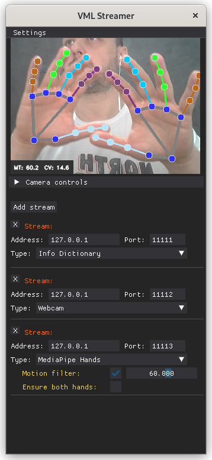

<!-- Splash logo

-->

# VML_Streamer
Vision and Machine Learning data streamer for 
[SideFX Houdini](https://www.sidefx.com/)

---

## How it works:

It streams data through UDP sockets. You can stream to different machines on a 
network by defining ip/port pairs for each stream.

Video is sent as a flattened numpy array (0-255 RGB values)<br/>
Data is sent as a json string (dumped python dict)

\**This program was made as a utility tool for Sidefx Houdini, but nothing 
hold you back from using it as a generic data server to feed your 
own udp client that decodes the data.*

# Installation

## Virtual environment setup:
Note: `pip install -r requirements.txt` can potentially give you errors 
(due to how specific OpenCV versions were frozen on Windows/Linux machines).

So consider recreating your virtual environment by hand:  
*(Tested on Python 3.10.\*)*

	# navigate to main dir
	cd VML_Streamer

	# create venv
	python -m venv venv

	# activate venv
	source venv/bin/activate # on Linux
	venv/Scripts/activate    # on Windows
	
	# install modules ("pyinstaller" only needed if you'll build binaries)
	pip install opencv-python mediapipe dearpygui dearpygui_extend pyinstaller

## Running:

	# after venv activated, run main program
	cd vml-streamer
	python main.py

<br/><br/>

<br/><br/>

---

# Adding custom streams

VML Streamer was created in a way that adding new stream types 
is simple and intuitive. 

## Step 1 - add your "process_[name].py" file

As an example, let's pretend we want to stream [vive 
tracker](https://www.vive.com/us/accessory/tracker3) positions: 

Create a file named "process_vive.py" inside the *vml-streamer* folder. Make sure
to have a method that returns a dict. Example:

```python 
def detect_vive_tracker():
	# some random 3d coordinates
	dummy_data = {} 
	dummy_data['vive_tracker'] = [
		{'x':  1.5, 'y':  3,   'z': -2.7},
		{'x': -3.4, 'y':  0.2, 'z':  4.5},
		{'x':  2.3, 'y': -2,   'z':  1.4},
	]
	return dummy_data
```

## Step 2 - include your new stream inside "stream_types.py" file

```python
ST_INFO_DICT = 'Info Dictionary'
ST_VIDEO     = 'Video'
ST_MP_HANDS  = 'MediaPipe Hands'
ST_MP_BODY   = 'MediaPipe Body'
ST_MP_FACE   = 'MediaPipe Face'
ST_VIVE      = 'Vive Tracker'  # <== OUR NEW STREAM TYPE!

ALL          = [v for k,v in globals().items() if k.startswith('ST_')]
```

## Step 3 - in the main program, import your file and send the data

Open "main.py", import your newly created file:

```python
import process_vive
```

Now look for `# loop through streams` comment (around line 215), 
add a conditional for your new stream type inside the for loop, like so:

```python
...
	# loop through streams
	streams = dpg_callback.get_streams()
	for i, stream in enumerate(streams):
		addr_port = (stream['address'], stream['port'])

		# VIVE TRACKER <== OUR NEW STREAM TYPE!
		if stream['type'] == st.ST_VIVE:
			vive_data = process_vive.detect_vive_tracker()
			skt.sendto(json.dumps(vive_data).encode(), addr_port)
...
```

That's it! now you should see a new stream type in the UI.

## Step 4 (optional) - Define custom config fields for your stream

If your new stream type need extra settings, you need to manually add them to 
the interface. Make sure to get familiar with the 
[DearPyGui](https://dearpygui.readthedocs.io/en/latest/) package.

Inside "dpg_callback.py", look for the **add_stream()** method. There is an
`# extra settings per stream type` for-loop (around line 180). Add 
your conditional there. Example:

```python
...
	# extra settings per stream type
	for t in st.ALL:
		tag_settings = f'{index}_{t}_settings'

		# custom extra settings for VIVE TRACKER <== OUR NEW STREAM TYPE!
		if t == st.ST_VIVE:
			with dpg.group(tag=tag_settings, indent=20, show=False):
				dpg.add_slider_float(tag=f'{tag_settings}_smoothingFactor', default_value=30, min_value=0, max_value=100)
...
```

With that, you can now access the "smoothing factor" value inside "main.py". 
It will be a new key under the **stream** dict variable:

```python
...
	# loop through streams
	streams = dpg_callback.get_streams()
	for i, stream in enumerate(streams):
		addr_port = (stream['address'], stream['port'])

		# VIVE TRACKER <== OUR NEW STREAM TYPE!
		if stream['type'] == st.ST_VIVE:
			smoothingFactor = stream['smoothingFactor'] # <== our new setting
			vive_data = process_vive.detect_vive_tracker(smoothingFactor)
			skt.sendto(json.dumps(vive_data).encode(), addr_port)
...
```

